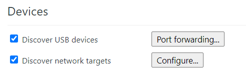

ps: 本文只针对ios移动端
### 准备工具
1. win10（自带powershell）
2. [scoop](https://github.com/lukesampson/scoop/wiki/Quick-Start) 安装：

    1. "Start" --> (Search) "cmd"
    2. "powershell"
    3. Invoke-Expression (New-Object System.Net.WebClient).DownloadString('https://get.scoop.sh')(可能需要翻墙)
3. itunes（自己下载）
4. nodejs(自己下载)
### 开始
#### step1
Connect your iOS device to your Windows 10 PC via USB
On your iOS device, go to Settings > Safari > Advanced and enable Web Inspector
#### step2
Instal the RemoteDebug iOS WebKit Adapter npm package:
npm i -g remotedebug-ios-webkit-adapter
#### step3
scoop bucket add extras https://github.com/lukesampson/scoop-extras.git
#### step4
scoop install ios-webkit-debug-proxy
#### step5
打开itunes连接手机，然后执行remotedebug_ios_webkit_adapter — port=9000
#### step6
在chrome中打开chrome://inspect/#devices

两个都勾选上，然后点击configure，添加监听地址localhost:9000

>本文转载自：https://medium.com/michal-ms/how-to-debug-a-website-in-ios-safari-on-windows-5aed4f806931
